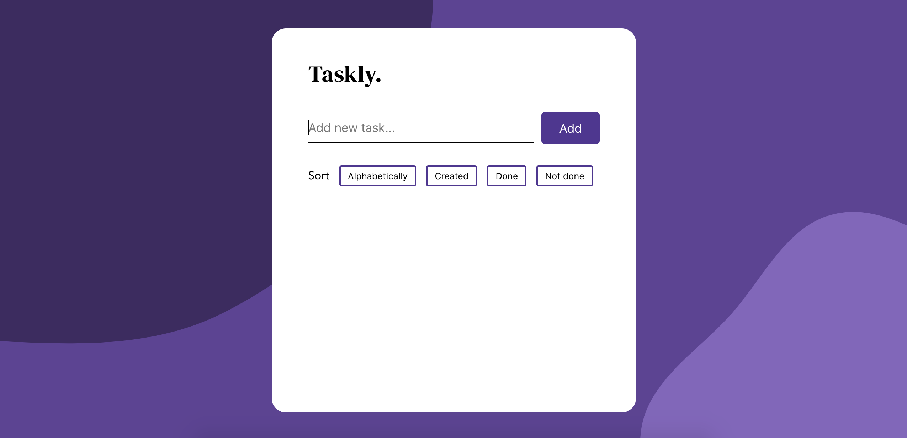

# Vue To-Do App
School project using Vue, TypeScript and Sass. Users can add and delete tasks, mark them as done and sort tasks by name, creation date and status.

https://taskly-vue-app.netlify.app/

## Installation
1. Clone the repo\
`git clone https://github.com/malin-nilsson/Vue-TodoApp`

2. Install npm packages\
`npm install`

3. Run Vue\
`npm run serve`

Visit localhost:8080 to view the project

## Author
- GitHub - [malin-nilsson](https://github.com/malin-nilsson)
